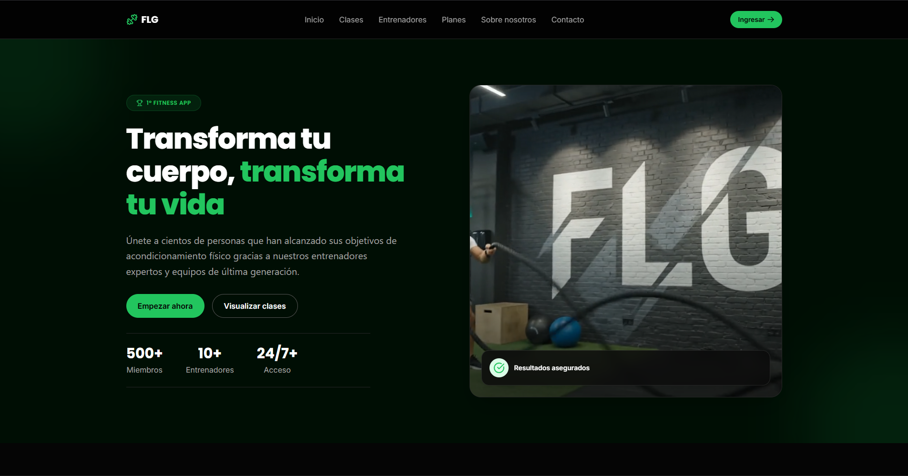
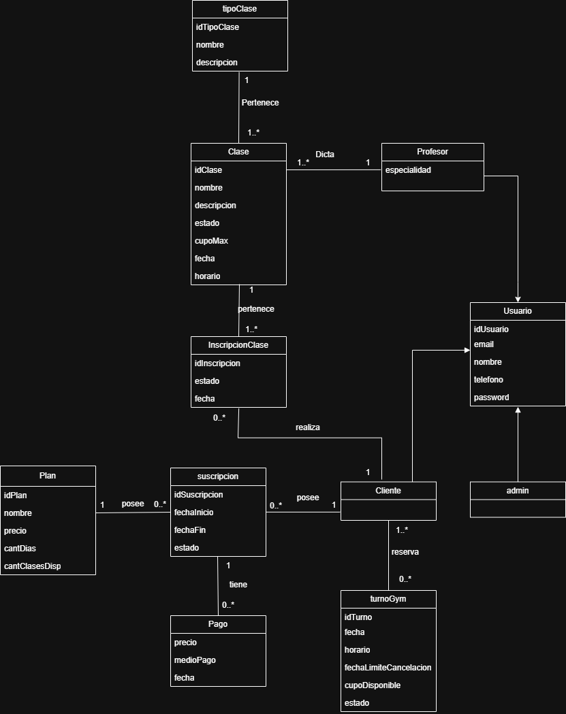

# FLG Gym

Plataforma de gestión integral para un gimnasio: administradores gestionan clases, profesores,
planes y pagos; socios reservan turnos, gestionan su suscripción y siguen su historial de pagos.

[](https://nodejs.org/)
[](https://nestjs.com/)
[](https://react.dev/)
[](https://www.typescriptlang.org/)
[](https://www.mysql.com/)
[](#índice)
[](#licencia)

Trabajo Práctico de la materia **Desarrollo de Software (UTN)**. No es un paquete publicado ni
tiene pipeline de CI — las badges de stack son informativas.

## Índice

- [Integrantes del grupo](#integrantes-del-grupo)
- [Acerca del proyecto](#acerca-del-proyecto)
- [Capturas](#capturas)
- [Stack](#stack)
- [Estructura del repositorio](#estructura-del-repositorio)
- [Modelo de dominio](#modelo-de-dominio)
- [Requisitos](#requisitos)
- [Instalación](#instalación)
- [Uso rápido](#uso-rápido)
- [Configuración](#configuración)
- [Scripts útiles](#scripts-útiles)
- [Flujo de trabajo / Contribuciones](#flujo-de-trabajo--contribuciones)
- [Soporte / Preguntas frecuentes](#soporte--preguntas-frecuentes)
- [Documentación adicional](#documentación-adicional)
- [Licencia](#licencia)
- [Agradecimientos](#agradecimientos)

## Integrantes del grupo

| Legajo | Integrante |
| :--- | :--- |
| 47853 | Furrer, Francisco |
| 52200 | Lovato, Gabriel |
| 52118 | Villavicencio, Luciano |

## Acerca del proyecto

FLG Gym reemplaza la gestión manual (planillas, WhatsApp, cuadernos) de un gimnasio por una
plataforma web con dos vistas: un **panel de administración** (clases, profesores, planes,
socios, cobros presenciales en efectivo/transferencia o con tarjeta vía Mercado Pago —terminal
Point o QR—) y un **panel de socio** (perfil, cambio de plan, tarjeta guardada para renovación
automática, historial de pagos). Nace como TP de la cátedra pero está pensado para poder correr
en un gimnasio real chico/mediano.

Funcionalidades principales:

- **Autenticación y roles**: login/registro propio y con Google (OAuth), JWT, y control de
  acceso por rol (`USER` / `ADMIN`) en cada endpoint y ruta del frontend.
- **Panel de socio**: edición de datos personales, cambio de plan de suscripción y consulta del
  historial de pagos propio.
- **Clases semanales**: el admin carga la grilla de una clase (días × horarios) de una sola vez
  y el socio se inscribe a un horario, que le queda reservado todas las semanas. El plan define
  cuántas clases incluye y cuántos cambios de clase permite por mes.
- **Panel de administración**: ABM de clases, turnos, profesores, planes y tipos de clase, con
  borrado lógico y restauración.
- **Gestión de socios**: búsqueda por DNI, email o nombre; edición de perfil, cambio de rol,
  alta/baja, pausa (con tope de días) y cancelación de suscripción desde el panel de
  administración.
- **Cobro unificado en mostrador**: el admin arma un cobro contra el plan/término elegido y lo
  cobra en efectivo/transferencia (se registra directo) o con tarjeta a través de la terminal
  Point o un QR fijo de Mercado Pago (se arma una orden que pasa a pendiente → pagada).
- **Comprobantes impresos**: los pagos en efectivo/transferencia se imprimen como recibo en la
  impresora integrada de la terminal Point, con log de cada intento para no reimprimir en un
  reintento.
- **Tarjeta guardada y renovación automática**: el socio puede guardar una tarjeta (tokenizada
  por Mercado Pago) para que su suscripción se renueve sola; un cron nocturno cobra antes del
  vencimiento, reintenta si falla y avisa por mail el resultado.
- **Reembolsos**: reembolso prorrateado (según meses ya usados, sin el descuento original) por
  Mercado Pago si el pago fue con tarjeta, o registrado manualmente si fue en efectivo.
- **Vista financiera**: panel separado del rol de admin, protegido por una contraseña propia
  (`OWNER_ANALYTICS_PASSWORD`), con ingresos en el tiempo, desglose por plan/método de pago y
  MRR estimado.
- **Formulario de contacto**: guarda el mensaje y notifica por email (Gmail) al staff del
  gimnasio.
- **Pagos presenciales**: historial de pagos visible tanto para el admin como para el propio
  socio.

## Capturas
Landing Page de FLG: [`assets/Landingpage.png`](assets/Landingpage.png).



Diagrama del modelo de dominio: [`assets/MD.drawio.png`](assets/MD.drawio.png).




## Stack

**Backend** (`back/`) — [NestJS](https://nestjs.com/) 11 + TypeORM + MySQL, autenticación JWT
(login/registro propio y Google OAuth), documentación Swagger, validación con `class-validator`.

**Frontend** (`front/`) — React 19 + Vite + TypeScript + Tailwind CSS, routing con
`react-router-dom`, autenticación vía `AuthContext` + rutas protegidas por rol.

## Estructura del repositorio

```
back/    API REST (NestJS)
front/   SPA (React + Vite)
assets/  Diagramas y recursos del proyecto
```

## Modelo de dominio

Entidades principales: `Users`, `Plan`, `Trainer`, `TypeClass`, `Class`, `ClassSession`,
`ClassRegistration`, `Subscription`, `Payment`, `Contact`, `ChargeOrder`, `Receipt`, `Refund`,
`SavedCard`. Todas soportan borrado lógico (`deleted`). Roles: `USER` (socio) y `ADMIN`.

### Clases semanales e inscripciones

- Un **turno** (`ClassSession`) es un horario **semanal**: una clase, un día de la semana
  (1 = lunes … 6 = sábado, domingo cerrado) y una hora, con su cupo. Se repite todas las
  semanas hasta que un admin lo cambia; no es una fecha puntual.
- Una **inscripción** (`ClassRegistration`) es una clase **a una hora**: reserva todos los
  turnos semanales de esa clase a esa hora (Funcional 08:00 → lunes, miércoles y viernes).
  Las filas de una misma inscripción comparten `enrollmentGroup`. El socio se inscribe una
  vez y mantiene el lugar; solo vuelve para cambiarlo.
- Cada **plan** define cuántas clases incluye en `maxClasses`: `0` ninguna, `N` hasta N clases
  a la vez, `NULL` ilimitadas.
- En un plan con cupo limitado, el socio puede **cambiar de clase dos veces por mes
  calendario**. La primera inscripción no cuenta; cambiar, o cancelar y volver a inscribirse
  en el mismo mes, sí.
- `class_session.dateTime` quedó como columna heredada del modelo por fecha: al arrancar, el
  backend migra las filas que todavía la tengan a `weekday`/`startTime` y la deja en `NULL`.
  Se puede eliminar la columna cuando todas las bases de datos del equipo hayan arrancado con
  esta versión al menos una vez.

## Requisitos

- Node.js 20 o superior
- npm
- MySQL 8 corriendo localmente (o accesible por red)
- (Opcional) credenciales de un OAuth Client de Google, para login con Google

## Instalación

```bash
git clone https://github.com/LucianoVillavicencio/UTN-DSW-Furrer-Lovato-Villavicencio.git
cd UTN-DSW-Furrer-Lovato-Villavicencio

cd back && npm install && cp .env.example .env
cd ../front && npm install && cp .env.example .env
```

Completá los `.env` (ver [Configuración](#configuración)) antes de levantar los servidores.

### Escaneo de secretos en pre-commit

El repositorio incluye un hook de pre-commit que rechaza cualquier commit que contenga una
credencial. Git no activa los hooks del working tree automáticamente, así que hay que habilitarlo
una vez por clon:

```bash
git config core.hooksPath .githooks
```

Requiere [gitleaks](https://github.com/gitleaks/gitleaks) en el `PATH`:

```bash
winget install --id gitleaks.gitleaks
```

El hook falla cerrado: si gitleaks no está instalado, rechaza el commit en lugar de dejarlo pasar
sin revisar. Para saltearlo deliberadamente, `git commit --no-verify`.

## Uso rápido

En dos terminales, desde la raíz del repo:

```bash
cd back && npm run start:dev
```

```bash
cd front && npm run dev
```

- Frontend: `http://localhost:5173`
- API: `http://localhost:3000/api/v1`
- Documentación interactiva de la API (Swagger): `http://localhost:3000/api`

## Configuración

### `back/.env`

| Variable | Descripción | Ejemplo |
| :--- | :--- | :--- |
| `PORT` | Puerto donde escucha la API | `3000` |
| `NODE_ENV` | En producción: desactiva el `synchronize` de TypeORM y deja de servir Swagger. Configurá esto en cualquier despliegue real. | `development` |
| `DB_HOST` | Host de MySQL | `localhost` |
| `DB_PORT` | Puerto de MySQL | `3306` |
| `DB_USER` | Usuario de MySQL | `root` |
| `DB_PASSWORD` | Password de MySQL | `root` |
| `DB_NAME` | Base de datos a usar | `flg` |
| `GOOGLE_CLIENT_ID` | Client ID de Google OAuth (login con Google) | `xxx.apps.googleusercontent.com` |
| `JWT_SECRET` | Secreto para firmar los JWT — generar uno propio (`openssl rand -base64 48`) | *(generado)* |
| `JWT_EXPIRES_IN` | Expiración de los tokens | `1d` |
| `FRONTEND_URL` | Origen permitido por CORS | `http://localhost:5173` |
| `GMAIL_USER` | Cuenta de Gmail que envía las notificaciones del formulario de contacto | `tu-cuenta@gmail.com` |
| `GMAIL_APP_PASSWORD` | App Password de esa cuenta (no la clave normal) | *(generada en Google)* |
| `MP_ENABLED` | Debe ser exactamente `true` para activar cobros con Mercado Pago y el cron de renovación. En `false` el sistema sigue funcionando con efectivo, reembolsos en efectivo, pausas y planes multi-mes | `false` |
| `MP_ACCESS_TOKEN` | Access token de la app de Mercado Pago | *(secreto, solo en `.env`)* |
| `MP_PUBLIC_KEY` | Public key de Mercado Pago | *(no secreta)* |
| `MP_WEBHOOK_SECRET` | Secreto para validar la firma de los webhooks de MP | *(secreto)* |
| `MP_POINT_TERMINAL_ID` | Terminal Point en modo PDV, formato `TIPO__SERIAL` | *(según terminal)* |
| `MP_QR_EXTERNAL_POS_ID` | `external_id` de la caja asociada al QR impreso | *(según caja)* |
| `OWNER_ANALYTICS_PASSWORD` | Contraseña de la vista financiera del panel (Resumen → "Ver más"). Opcional: sin definir, esa vista responde 503 y el resto del panel funciona igual. No es un rol; se revalida en cada request y rotarla cierra la vista para todos | *(elegida)* |

### `front/.env`

| Variable | Descripción | Ejemplo |
| :--- | :--- | :--- |
| `VITE_GOOGLE_CLIENT_ID` | Debe coincidir con `GOOGLE_CLIENT_ID` del backend | `xxx.apps.googleusercontent.com` |
| `VITE_API_URL` | URL base de la API | `http://localhost:3000/api/v1` |
| `VITE_WHATSAPP_NUMBER` | WhatsApp de atención, solo dígitos en formato internacional sin `+` | `5493410000000` |
| `VITE_MP_PUBLIC_KEY` | Public key de Mercado Pago para el Card Payment Brick (no es secreta) | *(no secreta)* |
| `VITE_MP_POINT_TERMINAL_ID` | Debe coincidir con `MP_POINT_TERMINAL_ID` del backend | *(según terminal)* |
| `VITE_MP_QR_EXTERNAL_POS_ID` | Debe coincidir con `MP_QR_EXTERNAL_POS_ID` del backend | *(según caja)* |

Ninguno de estos valores reales debe commitearse — los `.env` están en `.gitignore`, solo se
versionan los `.env.example`.

## Scripts útiles

| Comando (desde `back/` o `front/`) | Descripción |
| :--- | :--- |
| `npm run start:dev` *(back)* | Backend en modo watch |
| `npm run build` | Compila el proyecto |
| `npm run lint` | Linting |
| `npm test` *(back)* | Tests unitarios (Jest) |
| `npm run test:e2e` *(back)* | Tests end-to-end |
| `npm run dev` *(front)* | Servidor de desarrollo Vite |
| `npm test` *(front)* | Tests unitarios (Vitest) |
| `npm run preview` *(front)* | Sirve el build de producción del frontend |


## Flujo de trabajo / Contribuciones

Proyecto de equipo cerrado (3 integrantes) para la cátedra — no acepta contribuciones externas.
Convención interna: rama por feature (`feature/*`, `refactor/*`) contra `main`, integrada por
Pull Request.

```bash
git checkout -b feature/nombre-de-la-feature
# commits...
git push origin feature/nombre-de-la-feature
# abrir PR contra main
```

## Soporte / Preguntas frecuentes

- **¿Dónde veo todos los endpoints disponibles?** En Swagger, `http://localhost:3000/api`, con
  el backend corriendo.
- **El backend no conecta a MySQL.** Verificá que el servicio esté corriendo y que
  `DB_HOST`/`DB_USER`/`DB_PASSWORD`/`DB_NAME` en `back/.env` coincidan con tu instancia local.
- **El login con Google no funciona.** `GOOGLE_CLIENT_ID` (backend) y `VITE_GOOGLE_CLIENT_ID`
  (frontend) tienen que ser el mismo Client ID, y el origin `http://localhost:5173` debe estar
  autorizado en la configuración del OAuth Client en Google Cloud Console.
- Para dudas puntuales del TP, abrir un issue en este repositorio.

## Documentación adicional

- [`proposal.md`](proposal.md) — propuesta original del TP: alcance funcional y modelo de dominio.


## Licencia

Trabajo académico sin licencia pública (`UNLICENSED`) — código presentado como Trabajo Práctico
para la cátedra de Desarrollo de Software, UTN. Todos los derechos reservados a sus autores.

## Agradecimientos

- Cátedra de Desarrollo de Software, UTN FRRo (Mgter. Esp. Prof. Ing. Mario O. Bressano e Ing. Gabriel Golzman) — consigna y seguimiento del TP.
- [NestJS](https://nestjs.com/) y [Vite](https://vite.dev/) por la documentación de referencia
  usada durante el desarrollo.
